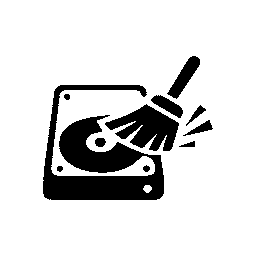
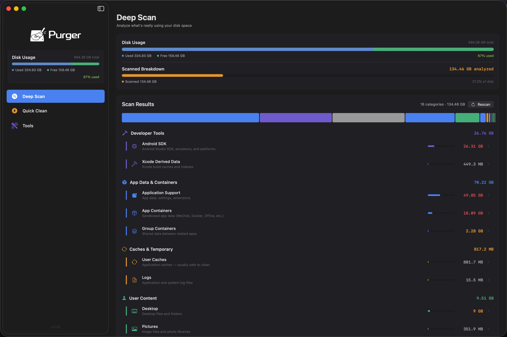
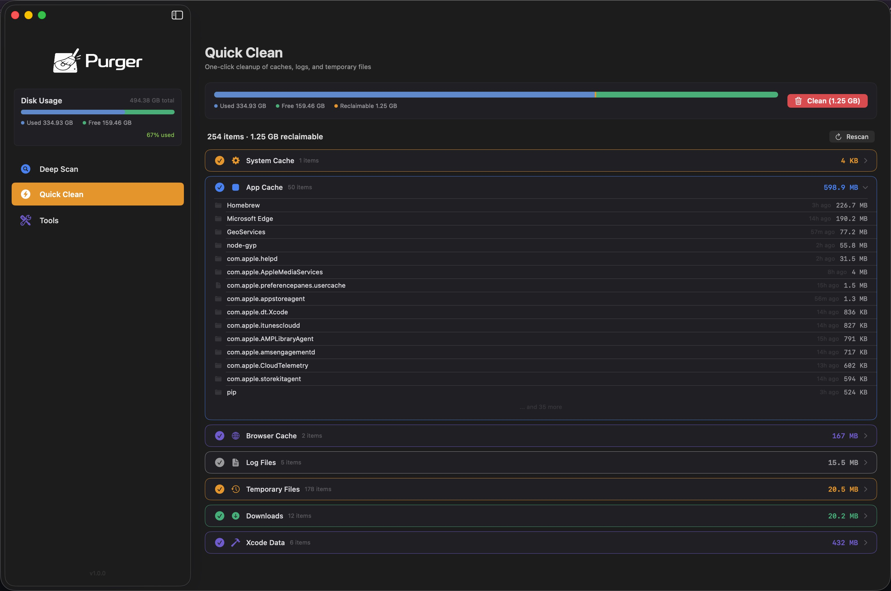
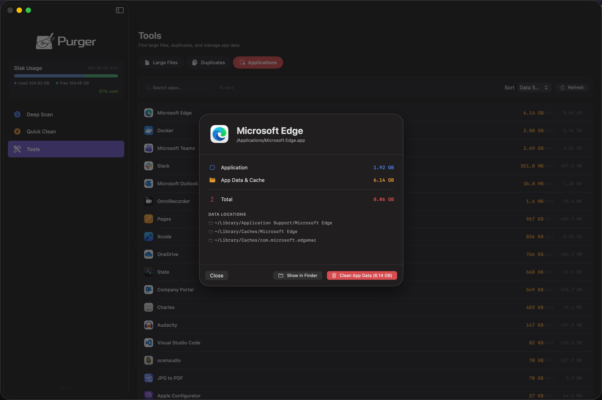

<p align="center">
  
</p>

<h1 align="center">Purger</h1>

<p align="center">
  A free, open-source macOS disk cleanup utility built with SwiftUI.
  <br>
  No subscriptions. No hidden fees. No black boxes.
</p>

<p align="center">
  
  
  
  
</p>

---

## Why Purger?

Most macOS cleanup tools (CleanMyMac, DaisyDisk, etc.) charge **$30–$90** or lock you into a subscription — and you never really know what they're doing under the hood. Purger is different:

| | Purger | Commercial Alternatives |
|---|---|---|
| **Price** | Free & open-source | $30–$90 or subscription |
| **Transparency** | Full source code, you see exactly what gets deleted | Black box |
| **Safety** | All deletions go to Trash — nothing is permanently lost | Varies |
| **Bloat** | Lightweight native SwiftUI app | Often bundled with antivirus, VPN upsells |
| **Smart Detection** | Only shows what actually exists on *your* machine | Generic scan lists |

## Features

### Deep Scan
Full disk analysis that shows exactly where your storage is going. Scans developer tools (Xcode, Android SDK, Homebrew, Docker), application support, caches, and more — only reports what actually exists on your machine.

### Quick Clean
One-click cleanup of system caches, logs, and temporary files. Review every item before cleaning — nothing is deleted without your confirmation, and everything goes to Trash first.

### Tools
- **Large Files** — Find the biggest space hogs across your disk
- **Duplicates** — Detect duplicate files using content hashing (CryptoKit)
- **Applications** — Browse installed apps, inspect their data footprint, and clean app caches with one click

## Screenshots

### Deep Scan
Analyze what's really using your disk space — developer tools, app data, caches, user content, and more, broken down by category with interactive size bars.

<p align="center">
  
</p>

### Quick Clean
One-click cleanup with full visibility. Expands each category (system cache, app cache, browser cache, logs, temp files, downloads, Xcode data) to show every item and its age before you clean.

<p align="center">
  
</p>

### Tools — Applications
Browse all installed apps sorted by data size. Inspect any app to see its bundle size, cache & data footprint, and exact disk locations — then clean with one click.

<p align="center">
  
</p>

## Requirements

- macOS 14.0 (Sonoma) or later
- Xcode 16+ (to build from source)

## Build

```bash
# Clone
git clone https://github.com/Bojun-Vvibe/Purger.git
cd Purger

# Build release
xcodebuild -project Purger.xcodeproj -scheme Purger -configuration Release build

# The built app is in DerivedData — or just open Purger.xcodeproj in Xcode and hit ⌘R
```

## Project Structure

```
Purger/
├── PurgerApp.swift          # App entry point
├── Models/
│   ├── AppState.swift       # Global app state
│   ├── CleanCategory.swift  # Cleanup category definitions
│   ├── ScanResult.swift     # Scan result data models
│   └── SidebarTab.swift     # Navigation tabs
├── Views/
│   ├── ContentView.swift    # Main layout with NavigationSplitView
│   ├── StorageAnalyzerView.swift  # Deep Scan UI
│   ├── QuickCleanView.swift       # Quick Clean UI
│   ├── ToolsView.swift            # Tools (Large Files / Duplicates / Apps)
│   ├── LargeFilesView.swift
│   ├── DuplicatesView.swift
│   ├── ApplicationsView.swift
│   ├── SystemJunkView.swift
│   ├── OverviewView.swift
│   └── SettingsView.swift
├── ViewModels/
│   ├── OverviewViewModel.swift
│   └── LargeFilesViewModel.swift
├── Services/
│   ├── DiskScannerService.swift   # File system scanning engine
│   └── CleanerService.swift       # File removal (move to Trash)
├── Utils/
│   ├── Formatters.swift     # Size formatting helpers
│   └── Theme.swift          # Colors, fonts, spacing, dimensions
└── Resources/
    ├── Assets.xcassets/     # App icon & colors
    └── Purger.entitlements  # Sandbox & file access permissions
```

## License

MIT License. See [LICENSE](LICENSE) for details.

---

# 中文说明

<p align="center">
  
</p>

<h3 align="center">Purger — 免费、安全、强大的 macOS 磁盘清理工具</h3>

## 为什么选 Purger？

市面上的 macOS 清理工具（CleanMyMac、DaisyDisk 等）动辄 **几百块** 甚至要求订阅，而且你根本不知道它到底在删什么。Purger 不一样：

- **完全免费** — 开源项目，MIT 协议，永久免费
- **安全透明** — 代码完全公开，所有删除操作只会移到废纸篓，不会直接抹掉任何文件
- **智能检测** — 只扫描你机器上真实存在的路径，不会虚报垃圾吓唬你付费
- **原生轻量** — 纯 SwiftUI 构建，无后台驻留，无捆绑推销

## 功能介绍

### 深度扫描（Deep Scan）
全盘分析磁盘空间占用，按分类展示：开发者工具（Xcode、Android SDK、Homebrew、Docker）、应用数据、缓存、用户内容等。只显示你机器上实际存在的项目。

### 快速清理（Quick Clean）
一键清理系统缓存、日志和临时文件。清理前可以展开查看每一项的大小和时间，确认无误后再清理。所有文件移到废纸篓，随时可以恢复。

### 工具箱（Tools）
- **大文件查找** — 快速定位占用空间最大的文件
- **重复文件检测** — 基于内容哈希（CryptoKit）精确识别重复文件
- **应用管理** — 查看已安装应用的数据占用，一键清理应用缓存和关联数据

## 截图

<p align="center">
  
  <br><em>深度扫描 — 全盘空间分析</em>
</p>

<p align="center">
  
  <br><em>快速清理 — 一键清理缓存和垃圾文件</em>
</p>

<p align="center">
  
  <br><em>工具箱 — 应用数据管理</em>
</p>

## 系统要求

- macOS 14.0 (Sonoma) 或更高版本
- Xcode 16+（从源码构建）

## 构建

```bash
# 克隆仓库
git clone https://github.com/Bojun-Vvibe/Purger.git
cd Purger

# 构建 Release 版本
xcodebuild -project Purger.xcodeproj -scheme Purger -configuration Release build

# 也可以直接用 Xcode 打开 Purger.xcodeproj，按 ⌘R 运行
```

## 开源协议

MIT License，详见 [LICENSE](LICENSE)。

---

> **Version 1.0.0** — 2026-03-23
